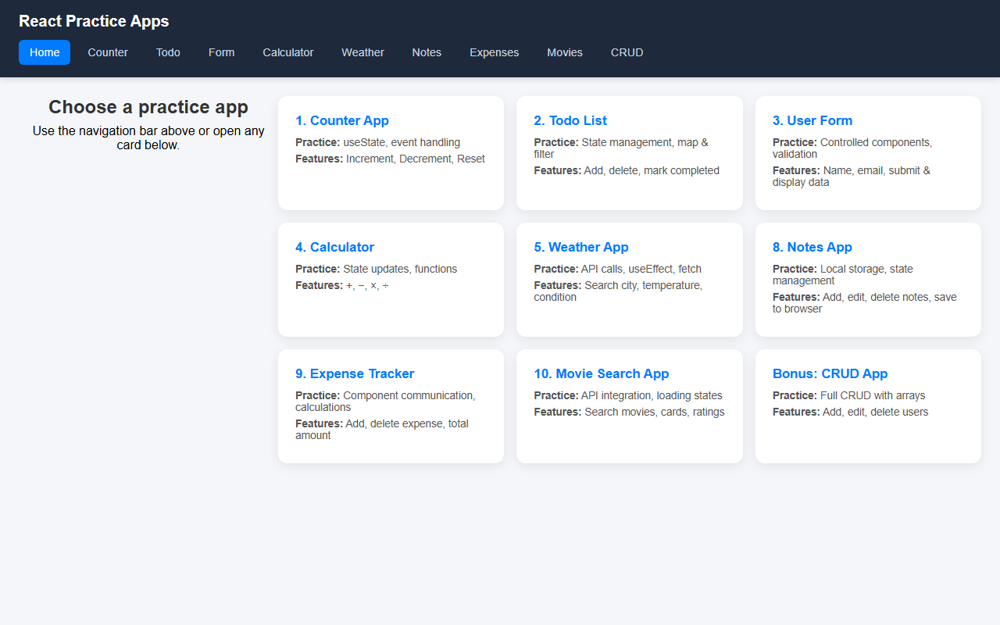
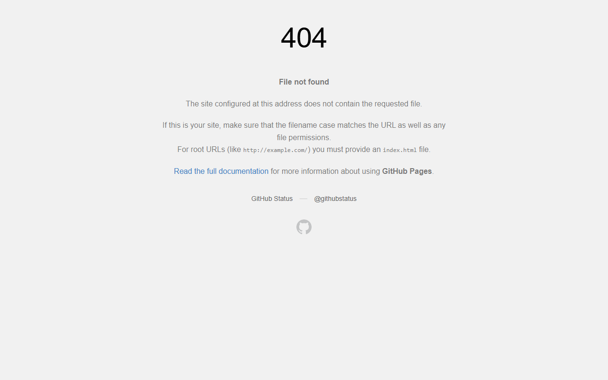

# React Practice Apps — Mini Projects Collection

> A single React app bundling **9 hands-on mini projects** plus a **full CRUD demo** — built to practice hooks, forms, APIs, localStorage, and component architecture. One repo, one live site, recruiter-friendly in 30 seconds.

[](https://enithachandrasekaran.github.io/react-curd-app/)
[](https://react.dev/)
[](https://vitejs.dev/)

**Live demo:** [enithachandrasekaran.github.io/react-curd-app](https://enithachandrasekaran.github.io/react-curd-app/)

**Author:** [Enitha Chandrasekaran](https://github.com/Enithachandrasekaran) · [Portfolio](https://enithachandrasekaran.github.io/enitha-portfolio/) · [LinkedIn](https://www.linkedin.com/in/enitha-c-2174a6230)

---

## Overview

This repository is a **React learning playground** — not one app, but a routed collection of small apps in one codebase. Each route focuses on a specific React concept (state, lists, forms, fetch, persistence, CRUD).

Ideal for portfolios, interviews, and demonstrating progressive React skills from basics to API integration.

---

## Features

| App | Route | What you practice | Try it live |
|-----|-------|-------------------|-------------|
| **Home hub** | `/` | React Router, navigation cards | [Open](https://enithachandrasekaran.github.io/react-curd-app/) |
| **Counter** | `/counter` | `useState`, event handling | [Open](https://enithachandrasekaran.github.io/react-curd-app/counter) |
| **Todo List** | `/todo` | Lists, `map`, `filter`, completed state | [Open](https://enithachandrasekaran.github.io/react-curd-app/todo) |
| **User Form** | `/form` | Controlled inputs, validation | [Open](https://enithachandrasekaran.github.io/react-curd-app/form) |
| **Calculator** | `/calculator` | State updates, arithmetic logic | [Open](https://enithachandrasekaran.github.io/react-curd-app/calculator) |
| **Weather** | `/weather` | `fetch`, async API, loading & errors | [Open](https://enithachandrasekaran.github.io/react-curd-app/weather) |
| **Notes** | `/notes` | `localStorage`, persist data in browser | [Open](https://enithachandrasekaran.github.io/react-curd-app/notes) |
| **Expense Tracker** | `/expenses` | Parent/child components, totals | [Open](https://enithachandrasekaran.github.io/react-curd-app/expenses) |
| **Movie Search** | `/movies` | REST API, search, loading UI | [Open](https://enithachandrasekaran.github.io/react-curd-app/movies) |
| **CRUD App** | `/crud` | Create, Read, Update, Delete with arrays | [Open](https://enithachandrasekaran.github.io/react-curd-app/crud) |

### Highlights

- **Single-page app** with shared layout and top navigation
- **No backend required** — APIs are public (Open-Meteo, TVMaze)
- **Auto-deploy** to GitHub Pages on every push to `main`
- **Clean component structure** — one folder per feature

---

## Screenshots

### Home dashboard


### Counter app


### Todo list


### CRUD app


### Movie search


### Weather app


---

## Tech Stack

| Category | Tools |
|----------|--------|
| **UI** | React 19, CSS |
| **Build** | Vite 8 |
| **Routing** | React Router 7 |
| **APIs** | Open-Meteo (weather), TVMaze (movies) |
| **Deploy** | GitHub Actions → GitHub Pages |

---

## Installation

### Prerequisites
- Node.js 18+

### Steps

```bash
git clone https://github.com/Enithachandrasekaran/react-curd-app.git
cd react-curd-app
npm install
npm run dev
```

Open **http://localhost:5173** in your browser.

### Build for production

```bash
npm run build
npm run preview
```

---

## Project structure

```
react-curd-app/
├── src/
│   ├── App.jsx              # Route definitions
│   ├── components/
│   │   ├── Layout.jsx       # Nav + outlet
│   │   └── expense/         # Expense tracker sub-components
│   └── pages/
│       ├── Home.jsx         # App hub / cards
│       ├── Counter.jsx
│       ├── TodoList.jsx
│       ├── UserForm.jsx
│       ├── Calculator.jsx
│       ├── WeatherApp.jsx
│       ├── NotesApp.jsx
│       ├── ExpenseTracker.jsx
│       ├── MovieSearch.jsx
│       └── CrudApp.jsx      # Full CRUD demo
├── .github/workflows/       # GitHub Pages deploy
└── vite.config.js
```

---

## What recruiters see in 30 seconds

1. **Live site** with 10 interactive demos — no setup needed  
2. **CRUD app** — core frontend skill check  
3. **API apps** — Weather & Movies show real `fetch` usage  
4. **Modern stack** — React 19 + Vite + Router  
5. **Deployed** — GitHub Pages CI/CD  

---

## Deployment

Pushes to `main` automatically build and deploy via GitHub Actions.

- **Workflow:** `.github/workflows/deploy.yml`
- **Live URL:** https://enithachandrasekaran.github.io/react-curd-app/

---

## Related projects

| Project | Description |
|---------|-------------|
| [smart-ui-app](https://github.com/Enithachandrasekaran/smart-ui-app) | RedStream — Blood Bank Management System (React + Express + MongoDB) |
| [enitha-portfolio](https://github.com/Enithachandrasekaran/enitha-portfolio) | Personal portfolio website |

---

## License

ISC
